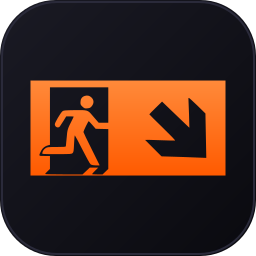

# LevisIDE

<p align="center">
  
</p>

<p align="center">
  <strong>Electron IDE pro webové projekty s integrací Claude Code.</strong><br>
  <em>"LevisIDE — Levis ide" (ostravské nářečí: Levis kráčí)</em>
</p>

<p align="center">
  
  
  
</p>

---

## Co to je

LevisIDE je desktopové vývojové prostředí postavené na Electronu. Spojuje terminál, editor, live preview a Git do jednoho okna. Navržené pro rychlý workflow s Claude Code — označíš element v náhledu, napíšeš co chceš změnit a pošleš rovnou do terminálu **včetně screenshotu vybrané oblasti**.

---

## Hlavní funkce

### Hub (přehled projektů)
- Scan projektů s detekcí **~40 typů** — Node (Next/Nuxt/Vite/React/Svelte/Astro/Angular/Remix/Gatsby/Nest/Expo/Electron/Tauri/Deno/Bun), Python (Django/Flask/FastAPI/Streamlit/Gradio), Ruby (Rails/Jekyll), PHP (Laravel/Symfony/WordPress), Go, Rust, .NET, Java/Spring, Kotlin, Elixir/Phoenix, Hugo, MkDocs, Docusaurus, Flutter, Jupyter a další
- **Typ filter dropdown** + fulltext search, připnutí oblíbených, per-projekt barvy a statusy
- **Velikost projektu** na dlaždici (počet souborů, velikost)
- **Recent files** z git logu na každé dlaždici
- **Interaktivní drag & drop řazení** (SortableJS — dlaždice se živě odsouvají)
- **Sort presety** — Naposled upraveno / Název / Velikost / Typ + možnost uložit vlastní pořadí jako pojmenovaný preset
- **Bulk actions** — Shift/Ctrl klik multi-select → hromadný status / barva / pin / pull / push / smazat
- Hromadný Pull/Push, scaffolding wizard (Vite, React, Vue, Svelte, Next.js, Astro)
- Kompaktní billing bar s přehledem Session / Weekly / Context / náklady

### Workspace
- Layout: sidebar (file tree) + terminál/editor + browser/náhled
- **Launch picker** — když má projekt víc entry pointů (dev server / statické index.html / Storybook), zeptá se uživatele a pamatuje si volbu per-projekt
- **Browser loader overlay** — vizuální feedback při startu Vite / Next / Expo dev serveru
- **Port collision handling** — paralelní detekce alt portu z PTY logu (Vite auto-increment apod.) + actionable error toast
- **Mobile preview** s default 150% zoomem pro HiDPI čitelnost
- **Drag-out** panelů do plovoucích oken (multi-monitor)
- **Pre-quit git check** — kontrola necommitovaných změn + běžících CC instancí při zavření

### Terminál
- xterm.js + node-pty, split terminal, WebGL renderer
- **Drag souborů z plochy** přímo do terminálu
- **Prompt fronta** s vizuálním UI (badge + popup pro správu/cancel)
- Shift+Enter line continuation, Ctrl+V paste (text + obrázky)

### Editor (Monaco)
- Multi-file tabs, dirty check, format on save
- Find/Replace s oranžovým highlight
- Drag & drop souborů z OS i file tree

### File tree
- Ikony per typ souboru, git status badges
- **Multi-select** (Ctrl+click, Shift+click, Ctrl+A)
- **Keyboard shortcuts** — Delete, Send to CC z context menu
- **Zachování stavu** — expanded složky přežijí refresh
- Klik zobrazí velikost souboru/složky ve status baru

### Inspector + Lasso (headline feature)
- Klikni na element v náhledu → floating popover → napiš prompt → CC dostane instrukci + screenshot
- Annotation canvas — nakresli oblast, popiš co změnit
- Screenshot se přiloží automaticky (30s auto-cleanup)
- **SPA-safe** — blokuje navigaci React/Next/Vue routerů během Inspect módu (window capture + history API override)
- **Smart selektory** — skip hashed CSS-in-JS classes (Emotion, RN Web), preferuje `aria-label` / `data-testid` / text content / role
- **Pin URL toggle** — klik pinne aktuální URL jako výchozí pro projekt, druhý klik odepne

### Témata
- 3 barevná schémata: **Dark** (default) / **Mid** / **Light** (warm cream/gray)

---

## Klávesové zkratky

Globální zkratky jsou sjednocené pod `Ctrl+Shift+` prefix (kromě OS standardů jako F1 a Ctrl+Tab).

| Zkratka | Akce |
|---------|------|
| `F1` / `?` | Help overlay |
| `Ctrl+Shift+P` | Command palette |
| `Ctrl+Shift+O` | Quick file open |
| `Ctrl+Shift+F` | Project search & replace |
| `Ctrl+Shift+T` | Přepnout na Hub |
| `Ctrl+Shift+R` | Hard reload (bez cache) |
| `Ctrl+Shift+W` | Zavřít aktivní tab |
| `Ctrl+Shift+,` | Nastavení |
| `Ctrl+Tab` / `Ctrl+Shift+Tab` | Cyklovat mezi taby |
| `Ctrl+S` (editor) | Uložit (s format) |
| `Ctrl+F` / `Ctrl+H` (editor) | Find / Replace |
| `Ctrl+A` (file tree) | Vybrat vše |
| `Delete` (file tree) | Smazat vybrané |
| `Shift+Enter` (terminál) | Line continuation |
| `Shift+klik` / `Ctrl+klik` (Hub tile) | Multi-select pro bulk actions |
| `Escape` (Hub) | Zrušit bulk výběr |

---

## Instalace

```bash
git clone https://github.com/Levisek/levis-ide-public.git
cd levis-ide-public
npm install          # nebo dvojklik: install.bat
npx tsc              # nebo dvojklik: build.bat
```

## Spuštění

```bash
# Vývoj (TypeScript watch + Electron)
npm run dev

# Jen spustit (vyžaduje předchozí build)
npm start
```

## Zástupce na ploše (Windows)

Dvojklik na `create-desktop-shortcut.bat` v kořeni → `LevisIDE.lnk` na ploše. Alternativně v aplikaci: Hub → Nastavení → *Vytvořit zástupce na ploše*.

## Build

```bash
# Windows NSIS installer
npm run build
```

---

## Technologie

| Co | Čím |
|----|-----|
| Framework | Electron 41 |
| Editor | Monaco Editor |
| Terminál | xterm.js + node-pty |
| Git | simple-git |
| Jazyk | TypeScript |
| Build | electron-builder |

---

## Changelog

Plná historie: [`CHANGELOG.md`](CHANGELOG.md)

### v1.5.1 (bezpečnost + i18n)
- **Bezpečnost:** `isPathAllowed` ve všech `fs:*` a `git:*` IPC handlerech (rename/duplicate/generateClaudeMd + 10× git), validace `store:set('scanPath', …)` (absolutní cesta, existuje, ne systémové lokace), `hardenWindow()` helper přidává `will-navigate` + `setWindowOpenHandler` do main / popout / panel oken (blok navigace mimo `file://`, blok `window.open` z rendereru, externí http(s) se otevřou v systémovém prohlížeči)
- **i18n:** ~108 nových překladových klíčů (browser, editor, diff, grid, workspace, panel, popout, titlebar, usage), popout + popout-panel nyní načítají `i18n.js` a inicializují jazyk přes `initI18n()` → `storeGet('locale')`, `data-i18n-title` / `data-i18n-placeholder` atributy v `index.html`, `popout.html`, `popout-panel.html`
- **Preload:** `preload-popout.ts` získal `storeGet` (nutné pro i18n locale čtení)

### v1.5.0
- **Hub:** rozšířená detekce typů projektů na **~40** — Python (Django/Flask/FastAPI/Streamlit/Gradio), Ruby (Rails/Jekyll), PHP (Laravel/Symfony/WordPress), Go, Rust, .NET, Java/Spring, Kotlin, Elixir/Phoenix, SSG (Hugo/MkDocs/Docusaurus/VitePress), Docker Compose, Flutter, Jupyter a další (detekce je **statická** — čte jen soubory, bez localhost pollu)
- **Hub:** drag & drop dlaždic mezi statusy Active/Paused/Finished, middle-click na tab projektu ho zavře, odstraněna fajfka u Finished
- **Workspace:** AUTOSTART doplněn o spouštěcí příkazy pro všechny nové typy (flask run, uvicorn, streamlit, php artisan, mkdocs, hugo server atd.)
- **Workspace:** dev-server timeout 30s → 120s (stíhají i pomalejší Spring Boot / Flask s DB init), refresh browseru jen po skutečném blur okna (už neskáče při kliku mimo webview)
- **Onboarding:** `create-desktop-shortcut.bat`, `install.bat`, `build.bat` v kořeni pro rychlý start + tlačítko *Vytvořit zástupce na ploše* v Nastavení
- **Nápověda:** lepší viditelnost scrollbaru v F1 help overlay
- **Hub footer:** kompaktní changelog pod LevisIDE™ logem (3 poslední verze + odkaz na celý)

### v1.4.2
- **Hub:** interaktivní drag & drop přes SortableJS (dlaždice se živě odsouvají), sort presety, bulk actions (Shift/Ctrl multi-select), Typ filter dropdown místo chip řady
- **Workspace:** Launch picker pro ambiguous entry pointy, browser loader overlay, port collision handling (paralelní PTY regex + alt port detection), mobile default 150% zoom
- **Inspector:** SPA-safe (blokuje navigaci React/Next routerů), chytré selektory (filter hashed classes, prefer aria/testid/text), Pin URL toggle
- **Vizuální:** sjednocené focus indikátory, token-based popover barvy (light theme fix), terminal mid theme bg odlišen, legenda symbolů přesunuta do F1
- **Kompatibilita:** klávesy sjednoceny pod `Ctrl+Shift+` prefix, dirty modal focus trap + autofocus
- **Build:** NSIS installer vytvoří desktop + start menu shortcut

### v1.4.0
- Témata: 3 schémata (Dark/Mid/Light warm), dark-soft odstraněn
- Hub: velikost projektu na dlaždicích, recent files, drag & drop řazení, icon-only toolbar
- Queue UI: vizuální správa prompt fronty (badge + popup + cancel)
- File tree: multi-select, keyboard shortcuts, context menu na složkách, zachování stavu
- Desktop drag: soubory z plochy do terminálu
- Status bar: velikost projektu + info o vybraném souboru
- Inspect/annotate auto-reset po odeslání

### v1.3.0
- Feedback formulář, logo/ikona, drag-back, editor handshake
- Tab badge, zvukové + OS notifikace, session persistence
- Split-handle + term-splitter fix, CC waiting detector fix

### v1.2.0
- Čistý terminal (toolbar odstraněn), popout multi-terminal
- Browser toolbar ikony-only, nové šablony (React/Vue/Svelte/Next/Astro)

### v1.1.0
- Sloučení panelů (Preview+Browser+Mobile → Browser)
- Témata, per-projekt barvy, prompt fronta, file tree ikony

### v1.0.0
- První release — workspace grid, drag-out, inspector, lasso screenshot

---

## Autor

**Martin Levinger** ([@Levisek](https://github.com/Levisek))

## Licence

ISC
